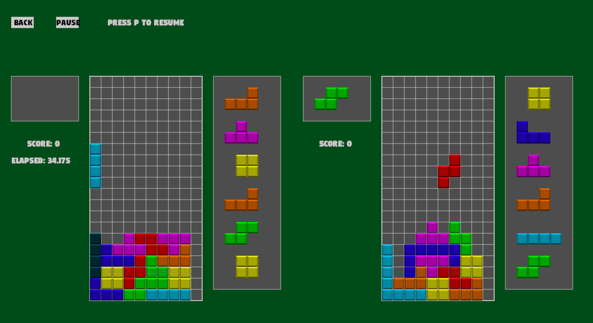

# Tetris in Rust




## What sort of Tetris is this ?

This is a 1 or 2 player Tetris (local or remote) so you can play against a friend !

Our implementation satisfies the *Super Rotation System*, that means the starting positions,
the rotations and wall-kicks are conforming to this standard.

## How do I play tetris?

Currently you can play tetris alone locally just with:
```bash
cargo run
```
Supposing you have cargo installed. Otherwise see [How to install cargo](README.md#wait-what-is-cargo-the-command-to-launch-the-game-doesnt-work-on-my-machine-).

It works well, only it's more fun to play with others right ?

I's also possible to play tetris remotely !

Remote 2 players only works if the IPs can ping each other,
a solution for this is connecting to the same mobile hotspot.

# Troubleshooting

## Wait, what is cargo?? The command to launch the game doesn't work on my machine :/

Then you can refer to the Great Rust Documentation : https://doc.rust-lang.org/cargo/getting-started/installation.html.

# Linker error for -lxcb-shape on Ubuntu

I think this fixes it
```
sudo apt-get install libxcb-shape0-dev libxcb-xfixes0-dev
```

## You're somewhat familiar with Rust and don't like the falling speed?

Then you're interested by the variable *gravity* in main.rs, set it how it fits you.

## Building for Windows from linux

Add the target (you can also change this for whatever target you're cross compiling for):

```rustup target add x86_64-pc-windows-gnu```

You can build your crate easily with:

```cargo build --release --target x86_64-pc-windows-gnu```

## You want to export a convenient zip?

See `export_exe.sh` and `export_linux.sh`.
