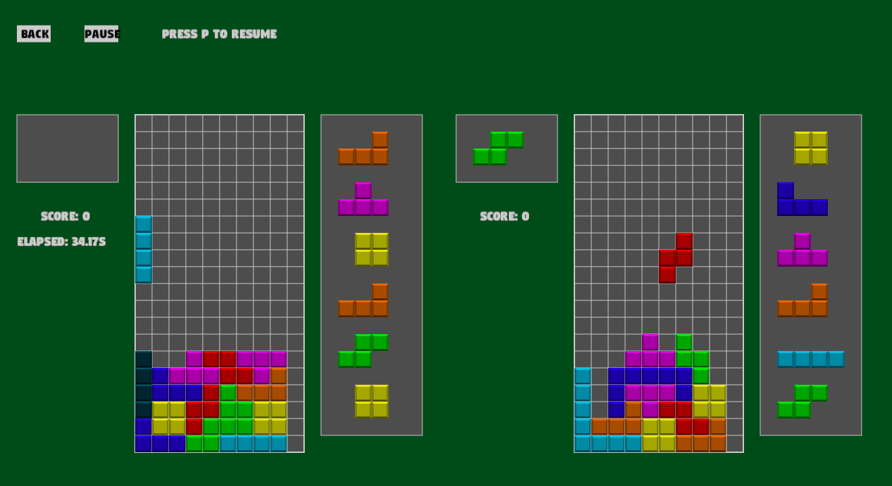

# Tetris in Rust

Currently our Tetris looks like this. 




## What sort of Tetris is this ?

Our Tetris has a multiplayer version, both a local one and a remote one, so you can play against a friend !

Our implementation satisfies the *Super Rotation System*, that means the starting positions, the rotations and wall-kicks are conforming to this standard.


## How do I play tetris?

Currently you can play tetris alone locally just with :
```bash
cargo run
```

It works well, only it's more fun to play with others right ?

I's also possible to play tetris remotely !

It doesn't work if the IPs can't ping each other, a solution to this is connecting to the same mobile hotspot.


## Wait, what is cargo?? The command to launch the game doesn't work on my machine :/

Then you can refer to the Great Rust Documentation : https://doc.rust-lang.org/cargo/getting-started/installation.html.


## You're somewhat familiar with Rust and also somehow distressed by the hazardous speed at which pieces are falling?

Then you're interested by the variable *gravity* in main.rs, set it how it fits you.
