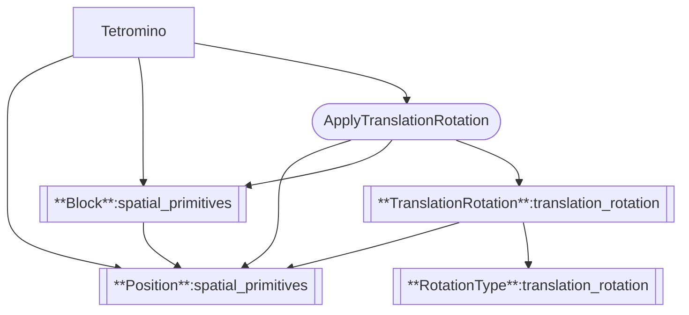

```mermaid
graph TD;
    Position[[**Position**:spatial_primitives]];
    Block[[**Block**:spatial_primitives]];
    TranslationRotation[[**TranslationRotation**:translation_rotation]];
    RotationType[[**RotationType**:translation_rotation]];
    applyTranslationRotation([ApplyTranslationRotation]);
    Tetromino-->Position;
    Tetromino-->Block;
    Tetromino-->applyTranslationRotation;
    applyTranslationRotation-->Position;
    applyTranslationRotation-->Block;
    applyTranslationRotation-->TranslationRotation;
    TranslationRotation-->Position;
    TranslationRotation-->RotationType;
    Block-->Position;
```