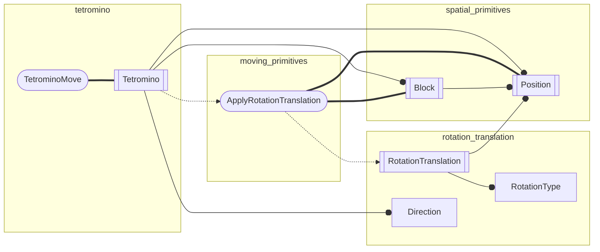

# Flowgraph

```mermaid
graph LR
    %% objects
    Position[[Position]]
    Block[[Block]]
    RotationTranslation[[RotationTranslation]]
    RotationType[RotationType]
    Direction[Direction]
    ApplyRotationTranslation([ApplyRotationTranslation])
    Tetromino[[Tetromino]]
    TetrominoMove([TetrominoMove])

    %% modules
    spatial_primitives[spatial_primitives]
    rotation_translation[rotation_translation]
    moving_primitives[moving_primitives]
    tetromino[tetromino]

    subgraph spatial_primitives
        Block --o Position
    end

    subgraph rotation_translation
        RotationTranslation --o RotationType
        Direction
    end

    RotationTranslation --o Position

    subgraph moving_primitives
        ApplyRotationTranslation
    end

    ApplyRotationTranslation === Position & Block
    ApplyRotationTranslation -.-> RotationTranslation

    subgraph tetromino
        TetrominoMove === Tetromino
    end

    Tetromino --o Position & Block & Direction
    Tetromino -.-> ApplyRotationTranslation
```