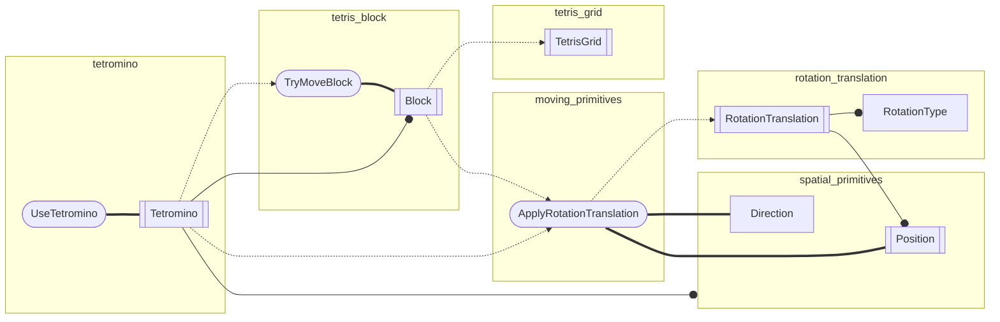
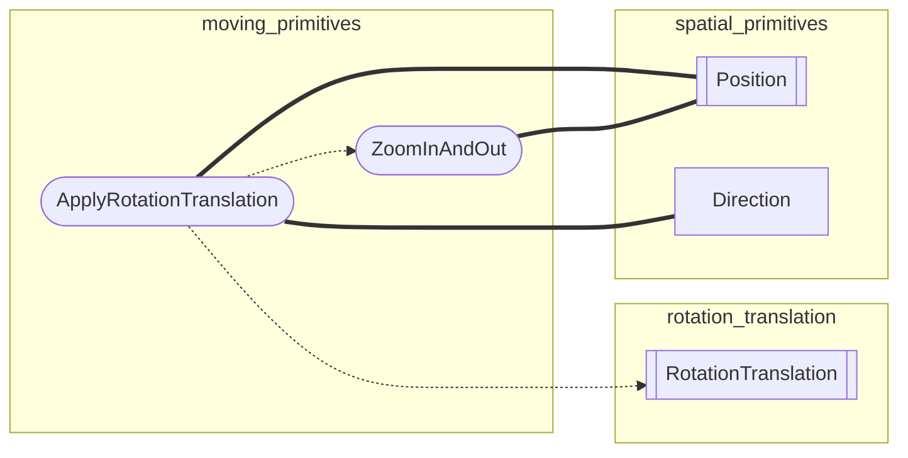

# Flowgraph

```mermaid
graph LR
    %% objects
    Position[[Position]]
    Direction[Direction]
    RotationTranslation[[RotationTranslation]]
    RotationType[RotationType]
    ApplyRotationTranslation([ApplyRotationTranslation])
    Block[[Block]]
    TryMoveBlock([TryMoveBlock])
    TetrisGrid[[TetrisGrid]]
    Tetromino[[Tetromino]]
    UseTetromino([UseTetromino])

    %% modules
    spatial_primitives[spatial_primitives]
    rotation_translation[rotation_translation]
    moving_primitives[moving_primitives]
    tetromino[tetromino]

    subgraph spatial_primitives
        Direction ~~~ Position
    end
    

    subgraph rotation_translation
        RotationTranslation --o RotationType
    end

    RotationTranslation --o Position

    subgraph moving_primitives
        ApplyRotationTranslation
    end

    ApplyRotationTranslation === Position & Direction
    ApplyRotationTranslation -.-> RotationTranslation
    
    subgraph tetris_block
        TryMoveBlock === Block
    end

    subgraph tetris_grid
        TetrisGrid
    end

    Block -.-> ApplyRotationTranslation & TetrisGrid

    subgraph tetromino
        UseTetromino === Tetromino
    end

    Tetromino --o spatial_primitives & Block
    Tetromino -.-> ApplyRotationTranslation & TryMoveBlock
```

```mermaid
graph LR
    %% objects
    Position[[Position]]
    Direction[Direction]
    RotationTranslation[[RotationTranslation]]
    ApplyRotationTranslation([ApplyRotationTranslation])
    ZoomInAndOut([ZoomInAndOut])

    %% modules
    rotation_translation[rotation_translation]
    spatial_primitives[spatial_primitives]
    moving_primitives[moving_primitives]

    subgraph spatial_primitives
        Position
        Direction
    end

    subgraph rotation_translation
        RotationTranslation
    end

    subgraph moving_primitives
        ApplyRotationTranslation
        ZoomInAndOut
    end

    ZoomInAndOut === Position
    ApplyRotationTranslation === Position & Direction
    ApplyRotationTranslation -.-> RotationTranslation
    ApplyRotationTranslation -.-> ZoomInAndOut

    ZoomInAndOut ~~~ Direction & RotationTranslation
```