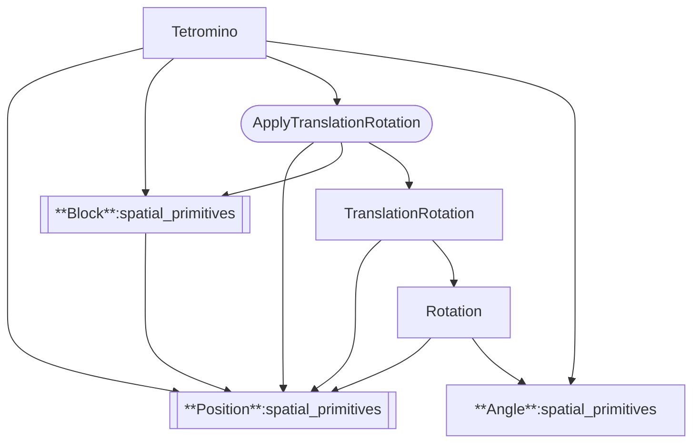

```mermaid
graph TD;
    Tetromino-->Position[[**Position**:spatial_primitives]];
    Tetromino-->Block[[**Block**:spatial_primitives]];
    Tetromino-->applyTranslationRotation([ApplyTranslationRotation]);
    applyTranslationRotation([ApplyTranslationRotation])-->Position[[**Position**:spatial_primitives]];
    applyTranslationRotation([ApplyTranslationRotation])-->Block[[**Block**:spatial_primitives]];
    applyTranslationRotation([ApplyTranslationRotation])-->TranslationRotation;
    TranslationRotation-->Position[[**Position**:spatial_primitives]];
    Block[[**Block**:spatial_primitives]]-->Position[[**Position**:spatial_primitives]];
    Tetromino-->**Angle**:spatial_primitives;
    TranslationRotation-->Rotation;
    Rotation-->Position;
    Rotation-->**Angle**:spatial_primitives;
```