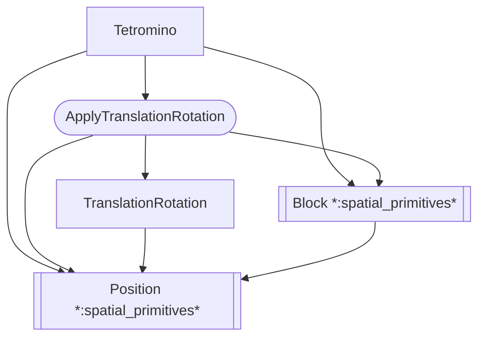

```mermaid
graph TD;
    Tetromino-->Position[[Position *:spatial_primitives*]];
    Tetromino-->applyTranslationRotation([ApplyTranslationRotation]);
    Tetromino-->Block[[Block *:spatial_primitives*]];
    applyTranslationRotation([ApplyTranslationRotation])-->Position[[Position *:spatial_primitives*]];
    applyTranslationRotation([ApplyTranslationRotation])-->Block[[Block *:spatial_primitives*]];
    applyTranslationRotation([ApplyTranslationRotation])-->TranslationRotation;
    TranslationRotation-->Position[[Position *:spatial_primitives*]];
    Block[[Block *:spatial_primitives*]]-->Position[[Position *:spatial_primitives*]];
```