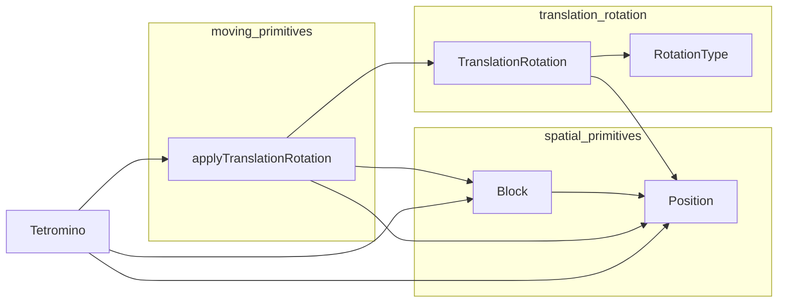

```mermaid
graph LR;
    Position[Position];
    Block[Block];
    TranslationRotation[TranslationRotation];
    RotationType[RotationType];
    spatial_primitives[spatial_primitives];
    translation_rotation[translation_rotation];
    moving_primitives[moving_primitives];
    subgraph spatial_primitives;
    Block-->Position;
    end;
    subgraph translation_rotation;
    TranslationRotation-->RotationType;
    end;
    TranslationRotation-->Position;
    subgraph moving_primitives;
    applyTranslationRotation;
    end;
    applyTranslationRotation-->Position;
    applyTranslationRotation-->Block;
    applyTranslationRotation-->TranslationRotation;
    Tetromino-->Position;
    Tetromino-->Block;
    Tetromino-->applyTranslationRotation;
```