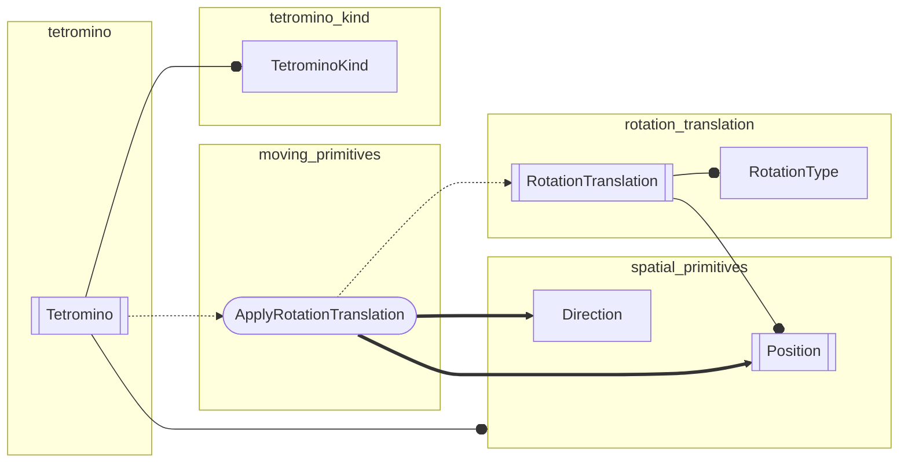
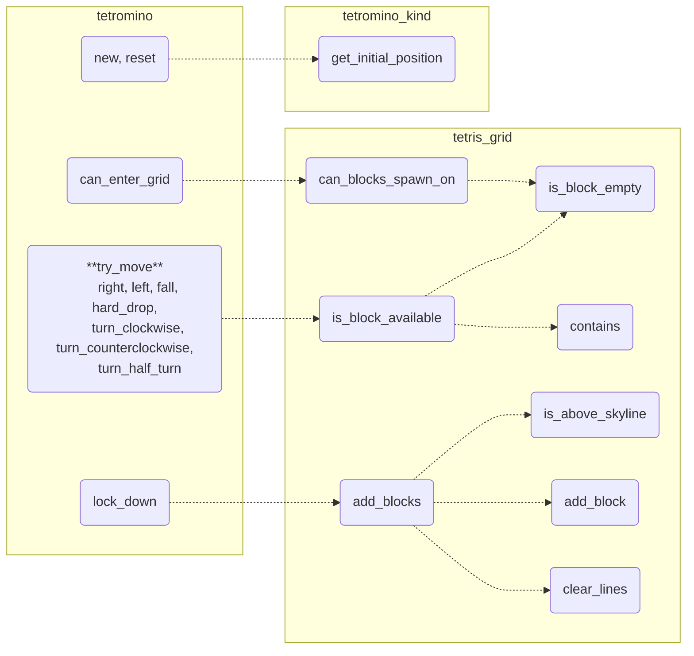
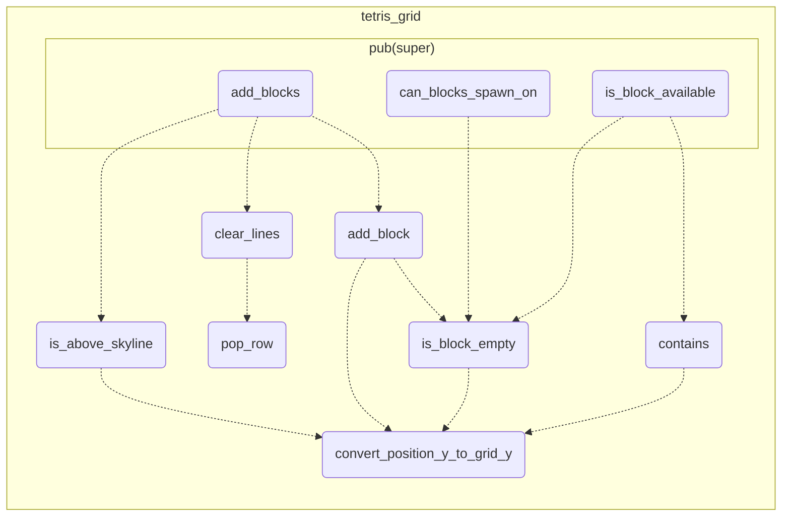

# `core`

```mermaid
graph LR
    %% objects
    Position[[Position]]
    Direction[Direction]
    RotationTranslation[[RotationTranslation]]
    RotationType[RotationType]
    ApplyRotationTranslation([ApplyRotationTranslation])
    %% TetrisGrid[[TetrisGrid]]
    Tetromino[[Tetromino]]
    %% GameOverError[GameOverError]
    TetrominoKind[TetrominoKind]

    subgraph spatial_primitives
        Direction ~~~ Position
    end

    subgraph rotation_translation
        RotationTranslation --o RotationType
    end

    RotationTranslation --o Position

    subgraph moving_primitives
        ApplyRotationTranslation
    end

    ApplyRotationTranslation ==> Position & Direction
    ApplyRotationTranslation -.-> RotationTranslation

    subgraph tetromino
        Tetromino
    end

    Tetromino -.-> ApplyRotationTranslation

    subgraph tetromino_kind
        TetrominoKind
    end

    %% subgraph tetris_grid
    %%     TetrisGrid
    %%     GameOverError
    %% end

    %% Tetromino ~~~ tetris_grid
    Tetromino --o spatial_primitives & TetrominoKind
```

# Using `Tetromino`

```mermaid
graph LR
    %% objects
    is_block_empty(is_block_empty)
    contains(contains)
    is_above_skyline(is_above_skyline)
    add_block(add_block)
    clear_lines(clear_lines)
    is_block_available(is_block_available)
    can_blocks_spawn_on(can_blocks_spawn_on)
    add_blocks(add_blocks)
    try_move(**try_move**
        right, left, fall, hard_drop,
        turn_clockwise, turn_counterclockwise,
        turn_half_turn)
    can_enter_grid(can_enter_grid)
    lock_down(lock_down)
    new(new, reset)
    get_initial_position(get_initial_position)

    %% modules
    tetris_grid[tetris_grid]
    tetromino[tetromino]
    tetromino_kind[tetromino_kind]

    subgraph tetris_grid
        can_blocks_spawn_on -.-> is_block_empty
        is_block_available -.-> contains & is_block_empty
        add_blocks -.-> add_block & clear_lines & is_above_skyline
    end

    subgraph tetromino_kind
        get_initial_position
    end

    subgraph tetromino
        new & can_enter_grid & try_move & lock_down
    end

    new -.-> get_initial_position
    can_enter_grid -.-> can_blocks_spawn_on
    try_move -.-> is_block_available
    lock_down -.-> add_blocks
```

# `TetrisGrid`

```mermaid
graph LR
    %% tetris grid
    clear_lines(clear_lines)
    pop_row(pop_row)
    is_above_skyline(is_above_skyline)
    add_block(add_block)

    is_block_empty(is_block_empty)
    convert_position_y_to_grid_y(convert_position_y_to_grid_y)

    contains(contains)

    add_blocks(add_blocks)
    can_blocks_spawn_on(can_blocks_spawn_on)
    is_block_available(is_block_available)

    subgraph tetris_grid
        subgraph "pub(super)"
            add_blocks
            can_blocks_spawn_on
            is_block_available
        end
        add_blocks -.-> is_above_skyline
        add_blocks -.-> clear_lines
        add_blocks -.-> add_block
    
        is_above_skyline -.-> convert_position_y_to_grid_y
        clear_lines -.-> pop_row
        add_block -.-> is_block_empty
        add_block -.-> convert_position_y_to_grid_y
    
        is_block_empty -.-> convert_position_y_to_grid_y

        contains -.-> convert_position_y_to_grid_y

        can_blocks_spawn_on -.-> is_block_empty
        is_block_available -.-> contains
        is_block_available -.-> is_block_empty
    end
```